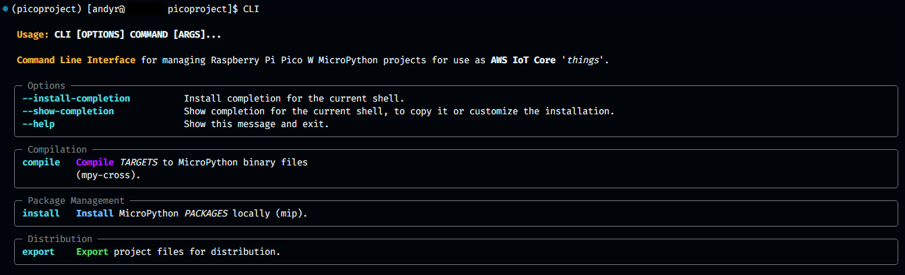
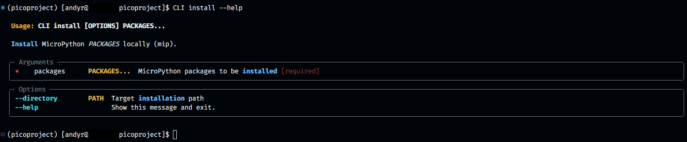
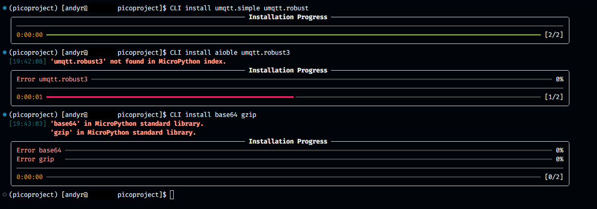
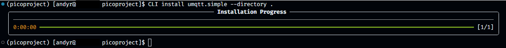

# A Command Line Interface (CLI) For Raspberry Pi Pico Project Management

>[!NOTE]
> This project is a WIP.

## Introduction

This package was designed to facilitate MicroPython project management for the Raspberry Pi Pico W. Currently the following functionality is implemented:

1. Compilation of project files to MicroPython binary (.mpy).
2. Installation of MicroPython packages into a projects local `lib/` directory.
3. Export of project files for distribution to a Pico device.

By installing packages locally, an IDE can highlight parameters/docstrings of imported modules. The CLI compile command can compile these packages along with your project files to MicroPython binary files (optional) and export them ready for distribution to a connected Pico device.

### Expected Project Layout

This CLI expects a 'flat' or 'src' layout in order to identify project paths. A '.picoproject' file in the root directory can be used to help denote your projects root directory and specify CLI config settings.

### Flat Layout Example

    ```text
    project-name
    ├── .picoproject     <-- Optional CLI root directory marker & config
    ├── project_name
    │   ├── lib          <-- CLI install command requires a 'lib' directory
    │   └── main.py
    ├── LICENSE
    ├── pyproject.toml
    └── README.md
    ```

### Src Layout Example

    ```text
    project-name
    ├── .picoproject      <-- Optional CLI root directory marker & config
    ├── src
    │   └── project_name
    │       ├── lib       <-- CLI install command requires a 'lib' directory
    │       └── main.py
    ├── LICENSE
    ├── pyproject.toml
    └── README.md
    ```

>[!TIP]
> LICENSE, pyproject.toml & README.md are used as project root markers
> in the absence of a .picoproject file in the project root directory.

## Installation

**uv** is used as the Python package manager. To install **uv** see the installation
guide @ [uv documentation](https://docs.astral.sh/uv/getting-started/installation/).

Installing the package with uv:

    ```sh
    uv add git+https://github.com/andyrids/picoproject
    ```

Activate your project virtual environment:

    ```sh
    source .venv/bin/activate
    ```

If installing with pip instead of uv:

    ```sh
    (project) python -m pip install git+https://github.com/andyrids/picoproject.git
    ```

This project has defined a CLI script in the `[project.scripts]` table of pyproject.toml, resulting in the ability to run the CLI with the following command:

    ```sh
    (project) uv run CLI
    ```

You can run the CLI as a module:

    ```sh
    (project) python -m picoproject.main
    ```

You can use the command 'CLI' in an activated .venv:

    ```sh
    (project) CLI
    ```

## CLI Commands

By default, when running the CLI without a command and options, the help is displayed.



### CLI install

The CLI navigates the MicroPython package index to install the chosen packages. These packages are installed in
the project's local `lib/` directory instead of a microcontroller device. This facilitates IDE autocompletion
and parsing of docstring information whilst developing locally.

    ```sh
    (project) CLI install --help
    ```


>[!NOTE]
> The install command currently only downloads the most recent version of a package.



It is possible to specify the install directory using the '--directory' option. The following command would install the `umqtt.simple` package to the current working directory:

    ```sh
    (project) CLI install umqtt.simple --directory .
    ```


If the project does not have a 'lib/' directory and a --directory option path is not specified, then the install command will fail. The error message will indicate a missing expected 'lib/' path in relation to the project's root directory.

### CLI compile

The CLI uses the `mpy-cross` package to compile Python to MicroPython precompiled binary (.mpy).

    ```sh
    (project) CLI compile --help
    ```

By default, all Python files will be compiled on issuing the CLI **compile** command:

    ```sh
    (project) CLI compile
    ```

## CLI export

The CLI creates an `export/` directory within the project root folder, and exports all project files
to this directory. By default all files are exported, but a precompiled only option causes the export
of only precompiled binary files (.mpy). Any Python files not previously precompiled are compiled and
exported automatically.

    ```sh
    (project) CLI export --help
    ```

To export all Python and MicroPython precompiled files, run the **export** command without the `--compiled-only`
option.

    ```sh
    (project) CLI export
    ```

Directory trees are displayed for the main project and export directories for comparison.

With the `--precompiled` option, the **export** command will only export precompiled Python files
(.mpy) and will attempt to compile and export if no existing compiled version is found. The directory
trees will highlight all files within the main project folder, which have not been exported.
